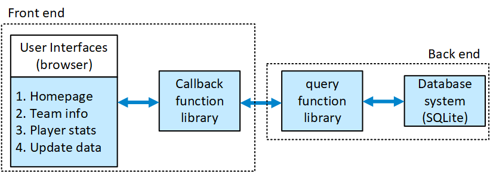
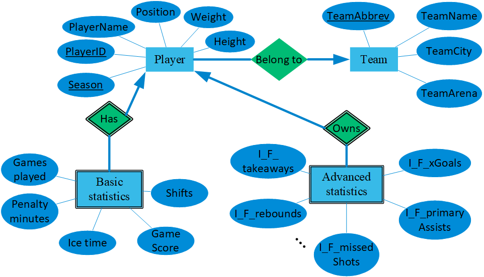

# Database System and Dashboard for National Hockey League
## About
This is the repo for the final project of CS 564: Database Management Systems in Summer 2022. We created a database management system for all player statistical data and team game data in National Hockey League (NHL) over all past seasons by using [SQLite](https://www.sqlite.org/index.html). And we implemented web-based user interfaces to update player data in the database and visualized player and team data in histograms, line charts, and tables by using [Dash Plotly](https://plotly.com/dash/). All programs are written in Python.

## Authors
[Bo-Hsun Chen](https://github.com/DanielYamChen), [Adilnur Istekov](https://github.com/adilnurgg), [Luke Neuendorf](https://github.com/lneuendorf/)

## Code Reference and Data Source
The web-based user interfaces and data visualization codes are mainly modified from the [MLB Data Explorer](https://github.com/devparra/baseball-hist-dash) repo and the interface designs are referred to the [MLB History](https://dash.gallery/dash-baseball-statistics/) gallery, and the NHL player and team game data are downloaded from the [Money Puck](https://moneypuck.com/)

## System structure

## ER Diagram

## Run
1. Clone the repository
2. Run `backend_functions.py` to build and run the DBMS
3. Run `index.py` to run the UI program, and open a web browser with the assigned URL to use the UI

P.S. Running was tested on Windows.

## Demo Video
[demo video](https://youtu.be/N0RCmNfdC8A)

## Disclaimer
These codes should not be copied/misused for other student assignments or final project.

